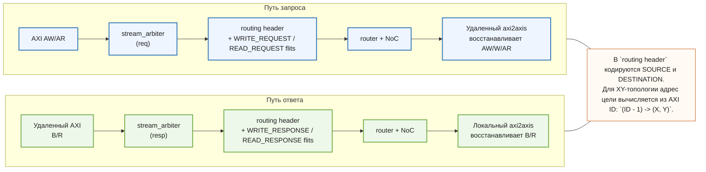

```mermaid
flowchart LR
    classDef req fill:#eef5ff,stroke:#2f75b5,color:#1f1f1f,stroke-width:2px;
    classDef resp fill:#eef8ea,stroke:#70ad47,color:#1f1f1f,stroke-width:2px;
    classDef note fill:#fffaf4,stroke:#c55a11,color:#1f1f1f,stroke-width:1px;

    subgraph REQ["Путь запроса"]
      direction LR
      Q1["AXI AW/AR"]
      Q2["stream_arbiter<br/>(req)"]
      Q3["routing header<br/>+ WRITE_REQUEST / READ_REQUEST flits"]
      Q4["router + NoC"]
      Q5["Удаленный axi2axis<br/>восстанавливает AW/W/AR"]
      Q1 --> Q2 --> Q3 --> Q4 --> Q5
    end

    subgraph RESP["Путь ответа"]
      direction LR
      P1["Удаленный AXI<br/>B/R"]
      P2["stream_arbiter<br/>(resp)"]
      P3["routing header<br/>+ WRITE_RESPONSE / READ_RESPONSE flits"]
      P4["router + NoC"]
      P5["Локальный axi2axis<br/>восстанавливает B/R"]
      P1 --> P2 --> P3 --> P4 --> P5
    end

    N["В `routing header` кодируются SOURCE и DESTINATION.<br/>Для XY-топологии адрес цели вычисляется из AXI ID: `(ID - 1) -> (X, Y)`."]
    REQ --- N
    RESP --- N

    class Q1,Q2,Q3,Q4,Q5 req
    class P1,P2,P3,P4,P5 resp
    class N note
```