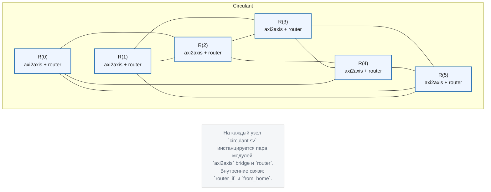

```mermaid
flowchart TB
    classDef node fill:#eef5ff,stroke:#2f75b5,color:#1f1f1f,stroke-width:2px;
    classDef hi fill:#fce4d6,stroke:#c55a11,color:#1f1f1f,stroke-width:2px;
    classDef note fill:#f4f6f8,stroke:#d9d9d9,color:#5b6573,stroke-width:1px;
      
    subgraph CIRCULANT["Circulant"]
      R00["R(0)<br/>axi2axis + router"]
      R01["R(1)<br/>axi2axis + router"]
      R02["R(2)<br/>axi2axis + router"]
      R03["R(3)<br/>axi2axis + router"]
      R04["R(4)<br/>axi2axis + router"]
      R05["R(5)<br/>axi2axis + router"]

      R00 --- R01
      R00 --- R02

      R01 --- R02
      R01 --- R03

      R02 --- R03
      R02 --- R04

      R03 --- R04
      R03 --- R05

      R04 --- R05
      R04 --- R00

      R05 --- R00
      R05 --- R01

    end

    CIRCULANT --- NOTE

    NOTE["На каждый узел `circulant.sv` инстанцируется пара модулей:<br/>`axi2axis` bridge и `router`.<br/>Внутренние связи: `router_if` и `from_home`."]

    class R00,R01,R02,R03,R04,R05 node
    class OUT,NOTE note
```