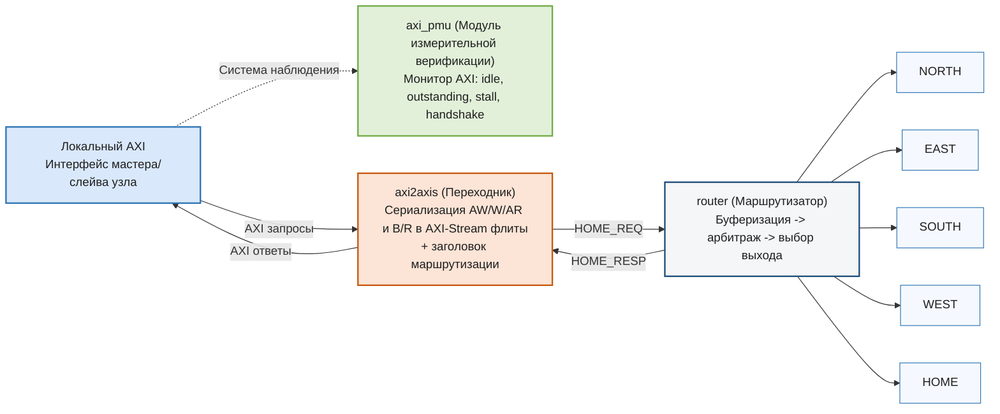

```mermaid
flowchart LR
    classDef blue fill:#d9e8fb,stroke:#2f75b5,color:#1f1f1f,stroke-width:2px;
    classDef green fill:#e2f0d9,stroke:#70ad47,color:#1f1f1f,stroke-width:2px;
    classDef orange fill:#fce4d6,stroke:#c55a11,color:#1f1f1f,stroke-width:2px;
    classDef navy fill:#f4f6f8,stroke:#1f4e79,color:#1f1f1f,stroke-width:2px;
    classDef port fill:#f5f9ff,stroke:#2f75b5,color:#1f1f1f,stroke-width:1px;

    AXI["Локальный AXI<br/>Интерфейс мастера/слейва узла"]
    PMU["axi_pmu (Модуль измерительной верификации)<br/>Монитор AXI: idle, outstanding, stall, handshake"]
    A2A["axi2axis (Переходник)<br/>Сериализация AW/W/AR и B/R в AXI-Stream флиты<br/>+ заголовок маршрутизации"]
    RTR["router (Маршрутизатор)<br/>Буферизация -> арбитраж -> выбор выхода"]

    N["NORTH"]
    E["EAST"]
    S["SOUTH"]
    W["WEST"]
    H["HOME"]

    AXI -->|"AXI запросы"| A2A
    A2A -->|"AXI ответы"| AXI
    AXI -. Система наблюдения .-> PMU

    A2A -->|"HOME_REQ"| RTR
    RTR -->|"HOME_RESP"| A2A

    RTR --> N
    RTR --> E
    RTR --> S
    RTR --> W
    RTR --> H

    class AXI blue
    class PMU green
    class A2A orange
    class RTR navy
    class N,E,S,W,H port
```