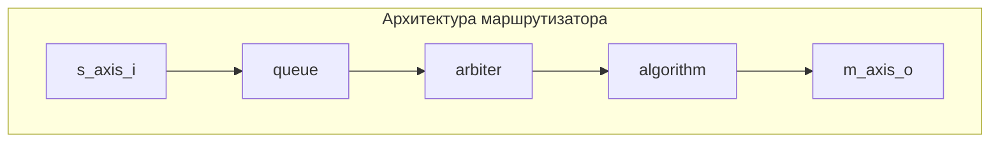

```mermaid
flowchart LR
    subgraph ARCH["Архитектура маршрутизатора"]
        direction LR

        I["s_axis_i"]
        Q["queue"]
        A0["arbiter"]
        G0["algorithm"]
        M["m_axis_o"]

        I --> Q
        Q --> A0
        A0 --> G0
        G0 --> M
    end
```