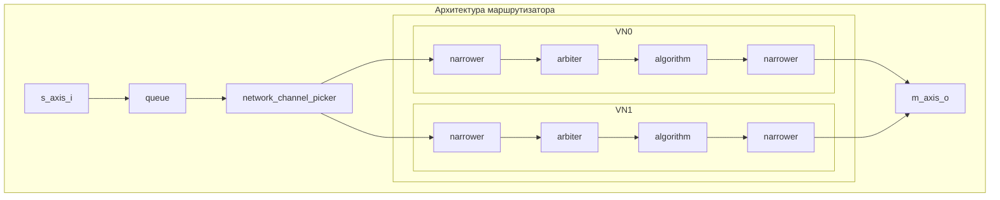

```mermaid
flowchart LR
    subgraph ARCH["Архитектура маршрутизатора"]
        direction LR

        I["s_axis_i"]
        Q["queue"]
        P["network_channel_picker"]

        subgraph VNS[" "]
            direction TB

            subgraph VN0["VN0"]
                direction LR
                N00["narrower"] --> A0["arbiter"] --> G0["algorithm"] --> N01["narrower"]
            end

            subgraph VN1["VN1"]
                direction LR
                N10["narrower"] --> A1["arbiter"] --> G1["algorithm"] --> N11["narrower"]
            end
        end

        M["m_axis_o"]

        I --> Q
        Q --> P
        P --> N00
        P --> N10
        N01 --> M
        N11 --> M
    end
```