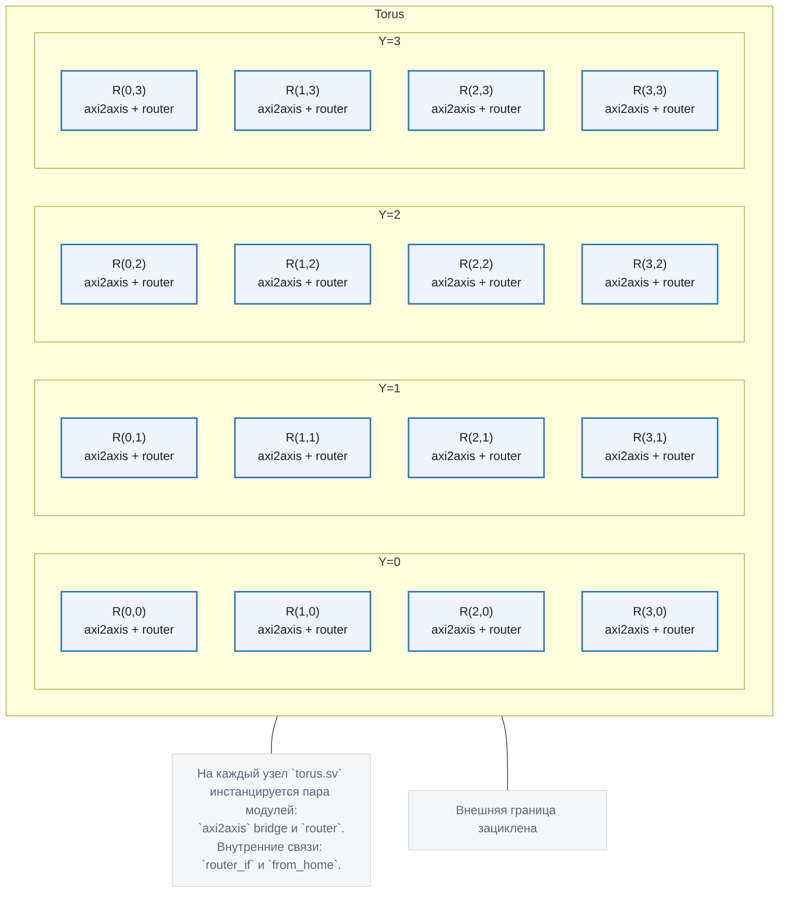

```mermaid
flowchart TB
    classDef node fill:#eef5ff,stroke:#2f75b5,color:#1f1f1f,stroke-width:2px;
    classDef hi fill:#fce4d6,stroke:#c55a11,color:#1f1f1f,stroke-width:2px;
    classDef note fill:#f4f6f8,stroke:#d9d9d9,color:#5b6573,stroke-width:1px;

    OUT["Внешняя граница зациклена"]

    subgraph ROW0["Y=0"]
      R00["R(0,0)<br/>axi2axis + router"]
      R10["R(1,0)<br/>axi2axis + router"]
      R20["R(2,0)<br/>axi2axis + router"]
      R30["R(3,0)<br/>axi2axis + router"]
    end

    subgraph ROW1["Y=1"]
      R01["R(0,1)<br/>axi2axis + router"]
      R11["R(1,1)<br/>axi2axis + router"]
      R21["R(2,1)<br/>axi2axis + router"]
      R31["R(3,1)<br/>axi2axis + router"]
    end

    subgraph ROW2["Y=2"]
      R02["R(0,2)<br/>axi2axis + router"]
      R12["R(1,2)<br/>axi2axis + router"]
      R22["R(2,2)<br/>axi2axis + router"]
      R32["R(3,2)<br/>axi2axis + router"]
    end

    subgraph ROW3["Y=3"]
      R03["R(0,3)<br/>axi2axis + router"]
      R13["R(1,3)<br/>axi2axis + router"]
      R23["R(2,3)<br/>axi2axis + router"]
      R33["R(3,3)<br/>axi2axis + router"]
    end

    subgraph TORUS["Torus"]
      ROW0
      ROW1
      ROW2
      ROW3
    end

    TORUS --- NOTE
    TORUS --- OUT

    NOTE["На каждый узел `torus.sv` инстанцируется пара модулей:<br/>`axi2axis` bridge и `router`.<br/>Внутренние связи: `router_if` и `from_home`."]

    class R00,R10,R20,R30,R01,R11,R21,R31,R02,R12,R22,R32,R03,R13,R23,R33 node
    class OUT,NOTE note
```