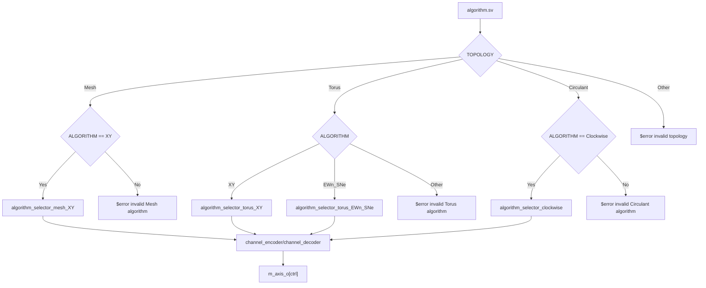

```mermaid
flowchart TD
    START["algorithm.sv"] --> TOPO{"TOPOLOGY"}

    TOPO -->|Mesh| MESHALG{"ALGORITHM == XY"}
    MESHALG -->|Yes| MXY["algorithm_selector_mesh_XY"]
    MESHALG -->|No| ERR1["$error invalid Mesh algorithm"]

    TOPO -->|Torus| TORALG{"ALGORITHM"}
    TORALG -->|XY| TXY["algorithm_selector_torus_XY"]
    TORALG -->|EWn_SNe| TEW["algorithm_selector_torus_EWn_SNe"]
    TORALG -->|Other| ERR2["$error invalid Torus algorithm"]

    TOPO -->|Circulant| CIRCALG{"ALGORITHM == Clockwise"}
    CIRCALG -->|Yes| CCLK["algorithm_selector_clockwise"]
    CIRCALG -->|No| ERR3["$error invalid Circulant algorithm"]

    TOPO -->|Other| ERR4["$error invalid topology"]

    MXY --> CHMAP["channel_encoder/channel_decoder"]
    TXY --> CHMAP
    TEW --> CHMAP
    CCLK --> CHMAP

    CHMAP --> OUT["m_axis_o[ctrl]"]
```
