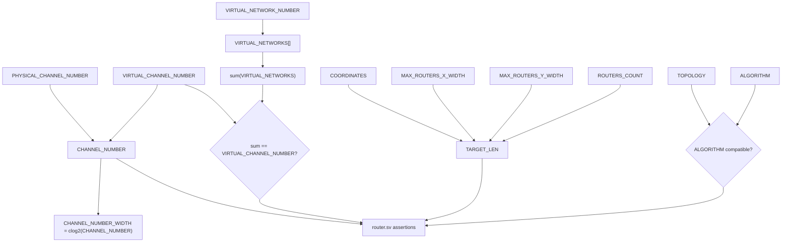

```mermaid
flowchart TD
    A["PHYSICAL_CHANNEL_NUMBER"] --> C["CHANNEL_NUMBER"]
    B["VIRTUAL_CHANNEL_NUMBER"] --> C
    C --> CW["CHANNEL_NUMBER_WIDTH = clog2(CHANNEL_NUMBER)"]

    VNN["VIRTUAL_NETWORK_NUMBER"] --> VNS["VIRTUAL_NETWORKS[]"]
    VNS --> SUM["sum(VIRTUAL_NETWORKS)"]
    B --> SUMCHK{"sum == VIRTUAL_CHANNEL_NUMBER?"}
    SUM --> SUMCHK

    COORD["COORDINATES"] --> TL["TARGET_LEN"]
    XW["MAX_ROUTERS_X_WIDTH"] --> TL
    YW["MAX_ROUTERS_Y_WIDTH"] --> TL
    RC["ROUTERS_COUNT"] --> TL

    TOPO["TOPOLOGY"] --> ALGCHK{"ALGORITHM compatible?"}
    ALG["ALGORITHM"] --> ALGCHK

    TL --> ASSERTS["router.sv assertions"]
    C --> ASSERTS
    SUMCHK --> ASSERTS
    ALGCHK --> ASSERTS
```
