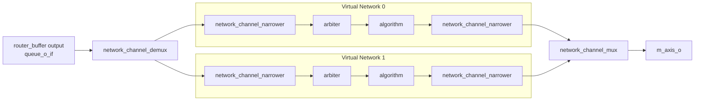

```mermaid
flowchart LR
    I["router_buffer output\nqueue_o_if"] --> DEMUX["network_channel_demux"]

    subgraph VN0["Virtual Network 0"]
      N0IN["network_channel_narrower"] --> A0["arbiter"] --> G0["algorithm"] --> N0OUT["network_channel_narrower"]
    end

    subgraph VN1["Virtual Network 1"]
      N1IN["network_channel_narrower"] --> A1["arbiter"] --> G1["algorithm"] --> N1OUT["network_channel_narrower"]
    end

    DEMUX --> N0IN
    DEMUX --> N1IN

    N0OUT --> MUX["network_channel_mux"]
    N1OUT --> MUX

    MUX --> O["m_axis_o"]
```
