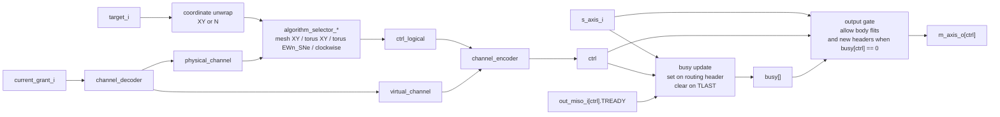

```mermaid
flowchart LR
    TARGET["target_i"] --> UNW["coordinate unwrap<br>XY or N"]
    GRANT["current_grant_i"] --> DEC["channel_decoder"]
    DEC --> PC["physical_channel"]
    DEC --> VC["virtual_channel"]

    UNW --> SEL["algorithm_selector_*<br>mesh XY / torus XY / torus EWn_SNe / clockwise"]
    PC --> SEL
    SEL --> CL["ctrl_logical"]

    CL --> ENC["channel_encoder"]
    VC --> ENC
    ENC --> CTRL["ctrl"]

    IN["s_axis_i"] --> GATE["output gate<br>allow body flits<br>and new headers when busy[ctrl] == 0"]
    CTRL --> GATE
    BUSY["busy[]"] --> GATE
    GATE --> OUT["m_axis_o[ctrl]"]

    IN --> BUPD["busy update<br>set on routing header<br>clear on TLAST"]
    CTRL --> BUPD
    RDY["out_miso_i[ctrl].TREADY"] --> BUPD
    BUPD --> BUSY
```