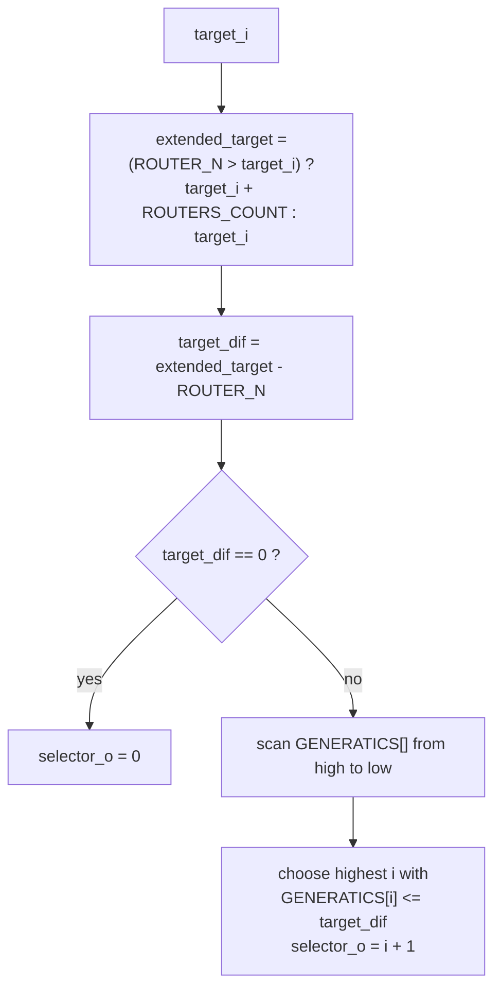

```mermaid
flowchart TD
    T["target_i"] --> EXT["extended_target =<br>(ROUTER_N > target_i) ?<br>target_i + ROUTERS_COUNT : target_i"]
    EXT --> DIF["target_dif = extended_target - ROUTER_N"]
    DIF --> Z{"target_dif == 0 ?"}
    Z -->|"yes"| HOME["selector_o = 0"]
    Z -->|"no"| LOOP["scan GENERATICS[] from high to low"]
    LOOP --> SEL["choose highest i with<br>GENERATICS[i] <= target_dif<br>selector_o = i + 1"]
```