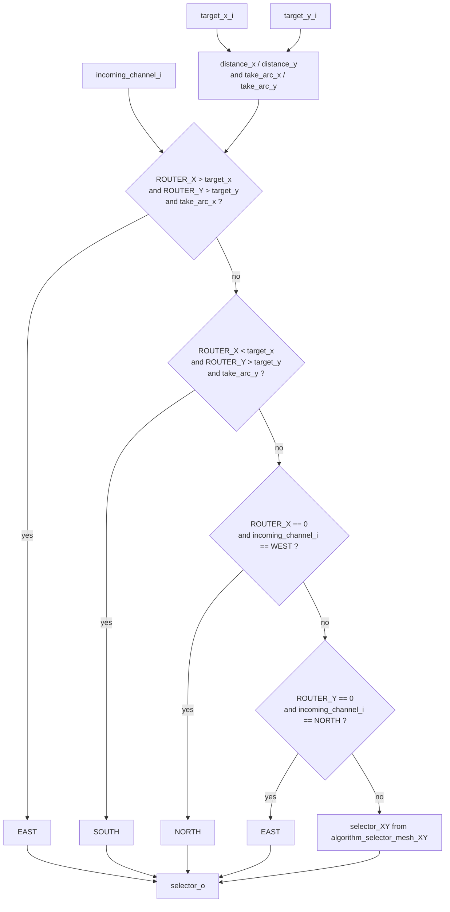

```mermaid
flowchart TD
    TX["target_x_i"] --> DIST["distance_x / distance_y<br>and take_arc_x / take_arc_y"]
    TY["target_y_i"] --> DIST
    INC["incoming_channel_i"] --> C1

    DIST --> C1{"ROUTER_X > target_x<br>and ROUTER_Y > target_y<br>and take_arc_x ?"}
    C1 -->|"yes"| E1["EAST"]
    C1 -->|"no"| C2{"ROUTER_X < target_x<br>and ROUTER_Y > target_y<br>and take_arc_y ?"}
    C2 -->|"yes"| S1["SOUTH"]
    C2 -->|"no"| C3{"ROUTER_X == 0<br>and incoming_channel_i == WEST ?"}
    C3 -->|"yes"| N1["NORTH"]
    C3 -->|"no"| C4{"ROUTER_Y == 0<br>and incoming_channel_i == NORTH ?"}
    C4 -->|"yes"| E2["EAST"]
    C4 -->|"no"| FALL["selector_XY from algorithm_selector_mesh_XY"]

    E1 --> OUT["selector_o"]
    S1 --> OUT
    N1 --> OUT
    E2 --> OUT
    FALL --> OUT
```