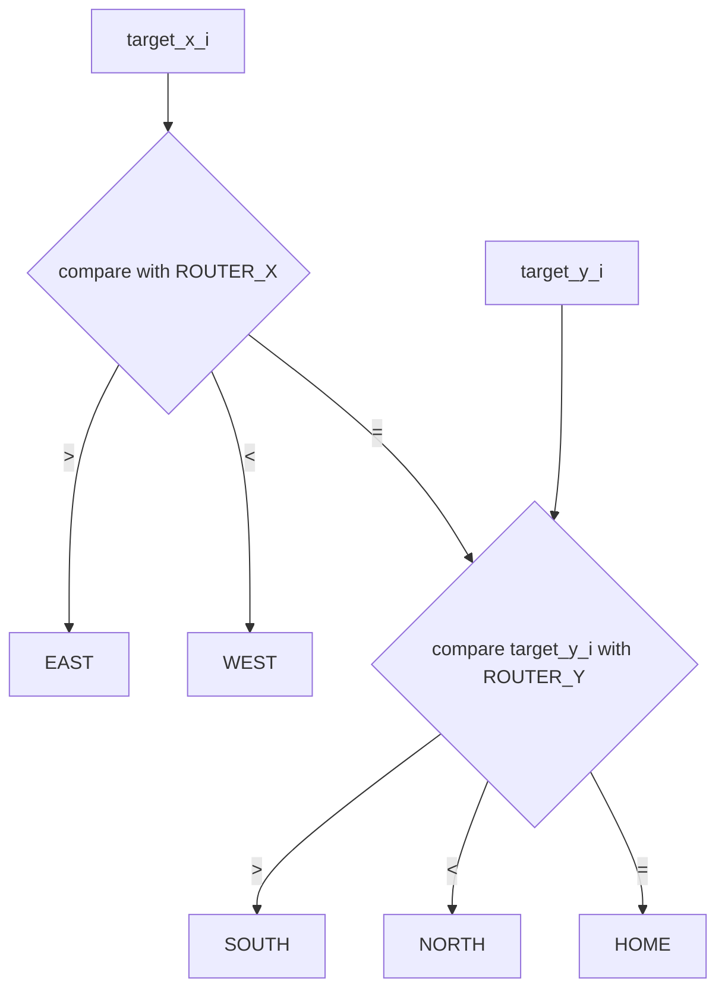

```mermaid
flowchart TD
    TX["target_x_i"] --> CX{"compare with ROUTER_X"}
    CX -->|">"| E["EAST"]
    CX -->|"<"| W["WEST"]
    CX -->|"="| CY{"compare target_y_i with ROUTER_Y"}
    TY["target_y_i"] --> CY
    CY -->|">"| S["SOUTH"]
    CY -->|"<"| N["NORTH"]
    CY -->|"="| H["HOME"]
```