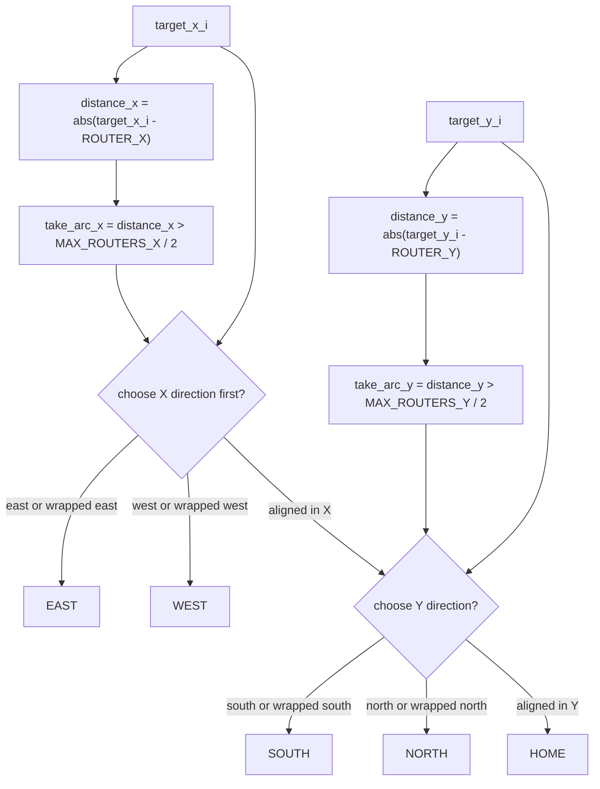

```mermaid
flowchart TD
    TX["target_x_i"] --> DX["distance_x = abs(target_x_i - ROUTER_X)"]
    TY["target_y_i"] --> DY["distance_y = abs(target_y_i - ROUTER_Y)"]
    DX --> AX["take_arc_x = distance_x > MAX_ROUTERS_X / 2"]
    DY --> AY["take_arc_y = distance_y > MAX_ROUTERS_Y / 2"]

    AX --> XDEC{"choose X direction first?"}
    TX --> XDEC
    XDEC -->|"east or wrapped east"| E["EAST"]
    XDEC -->|"west or wrapped west"| W["WEST"]
    XDEC -->|"aligned in X"| YDEC{"choose Y direction?"}

    AY --> YDEC
    TY --> YDEC
    YDEC -->|"south or wrapped south"| S["SOUTH"]
    YDEC -->|"north or wrapped north"| N["NORTH"]
    YDEC -->|"aligned in Y"| H["HOME"]
```