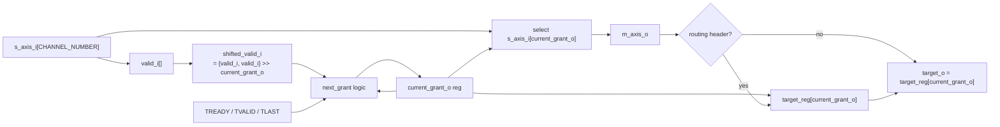

```mermaid
flowchart LR
    IN["s_axis_i[CHANNEL_NUMBER]"] --> VM["valid_i[]"]
    VM --> SH["shifted_valid_i<br>= {valid_i, valid_i} >> current_grant_o"]
    CG["current_grant_o reg"] --> NG["next_grant logic"]
    SH --> NG
    HS["TREADY / TVALID / TLAST"] --> NG
    NG --> CG

    IN --> MUX["select s_axis_i[current_grant_o]"]
    CG --> MUX
    MUX --> OUT["m_axis_o"]

    OUT --> HDR{"routing header?"}
    CG --> TREG["target_reg[current_grant_o]"]
    HDR -->|"yes"| TREG
    HDR -->|"no"| TO["target_o = target_reg[current_grant_o]"]
    TREG --> TO
```