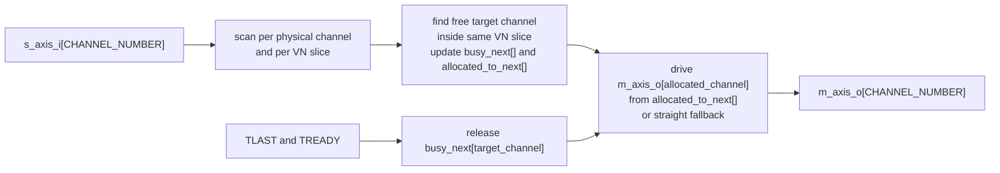

```mermaid
flowchart LR
    IN["s_axis_i[CHANNEL_NUMBER]"] --> SCAN["scan per physical channel<br>and per VN slice"]
    SCAN --> ALLOC["find free target channel<br>inside same VN slice<br>update busy_next[] and allocated_to_next[]"]
    ALLOC --> MUX["drive m_axis_o[allocated_channel]<br>from allocated_to_next[]<br>or straight fallback"]
    TL["TLAST and TREADY"] --> REL["release busy_next[target_channel]"]
    REL --> MUX
    MUX --> OUT["m_axis_o[CHANNEL_NUMBER]"]
```