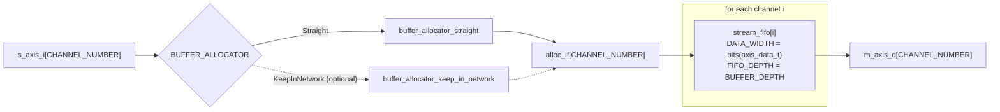

```mermaid
flowchart LR
    IN["s_axis_i[CHANNEL_NUMBER]"] --> SEL{"BUFFER_ALLOCATOR"}
    SEL -->|"Straight"| STR["buffer_allocator_straight"]
    SEL -.->|"KeepInNetwork (optional)"| KEEP["buffer_allocator_keep_in_network"]

    STR --> ALLOC["alloc_if[CHANNEL_NUMBER]"]
    KEEP -.-> ALLOC

    subgraph FIFOS["for each channel i"]
        direction LR
        FI["stream_fifo[i]<br>DATA_WIDTH = bits(axis_data_t)<br>FIFO_DEPTH = BUFFER_DEPTH"]
    end

    ALLOC --> FI --> OUT["m_axis_o[CHANNEL_NUMBER]"]
```