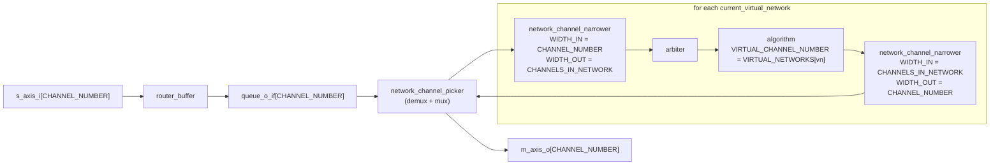

```mermaid
flowchart LR
    IN["s_axis_i[CHANNEL_NUMBER]"] --> BUF["router_buffer"]
    BUF --> Q["queue_o_if[CHANNEL_NUMBER]"]
    Q --> PICK["network_channel_picker<br>(demux + mux)"]

    subgraph VNS["for each current_virtual_network"]
        direction LR
        N1["network_channel_narrower<br>WIDTH_IN = CHANNEL_NUMBER<br>WIDTH_OUT = CHANNELS_IN_NETWORK"]
        ARB["arbiter"]
        ALG["algorithm<br>VIRTUAL_CHANNEL_NUMBER = VIRTUAL_NETWORKS[vn]"]
        N2["network_channel_narrower<br>WIDTH_IN = CHANNELS_IN_NETWORK<br>WIDTH_OUT = CHANNEL_NUMBER"]
        N1 --> ARB --> ALG --> N2
    end

    PICK --> N1
    N2 --> PICK
    PICK --> OUT["m_axis_o[CHANNEL_NUMBER]"]
```