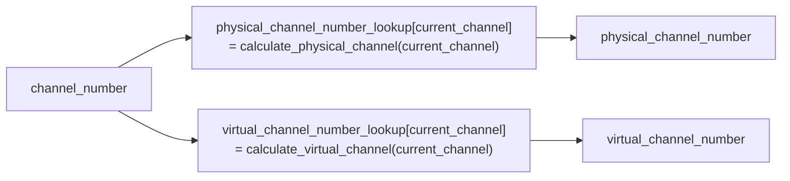

```mermaid
flowchart LR
    CH["channel_number"] --> PLOOK["physical_channel_number_lookup[current_channel]<br>= calculate_physical_channel(current_channel)"]
    CH --> VLOOK["virtual_channel_number_lookup[current_channel]<br>= calculate_virtual_channel(current_channel)"]
    PLOOK --> P["physical_channel_number"]
    VLOOK --> V["virtual_channel_number"]
```