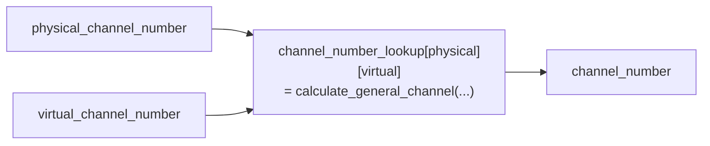

```mermaid
flowchart LR
    P["physical_channel_number"] --> LUT["channel_number_lookup[physical][virtual]<br>= calculate_general_channel(...)" ]
    V["virtual_channel_number"] --> LUT
    LUT --> CH["channel_number"]
```