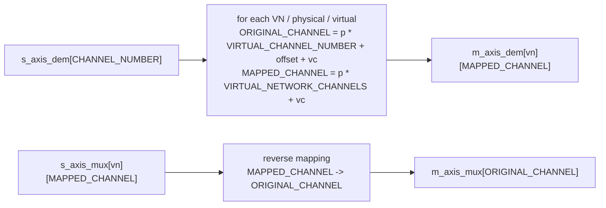

```mermaid
flowchart LR
    IN["s_axis_dem[CHANNEL_NUMBER]"] --> MAP1["for each VN / physical / virtual<br>ORIGINAL_CHANNEL = p * VIRTUAL_CHANNEL_NUMBER + offset + vc<br>MAPPED_CHANNEL = p * VIRTUAL_NETWORK_CHANNELS + vc"]
    MAP1 --> DEM["m_axis_dem[vn][MAPPED_CHANNEL]"]

    MUXIN["s_axis_mux[vn][MAPPED_CHANNEL]"] --> MAP2["reverse mapping<br>MAPPED_CHANNEL -> ORIGINAL_CHANNEL"]
    MAP2 --> OUT["m_axis_mux[ORIGINAL_CHANNEL]"]
```