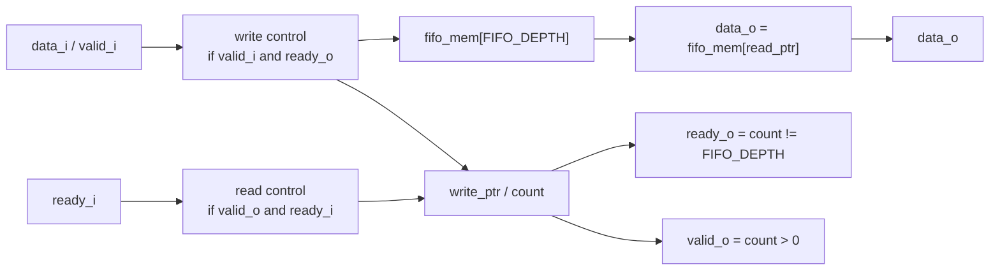

```mermaid
flowchart LR
    IN["data_i / valid_i"] --> WR["write control\nif valid_i and ready_o"]
    WR --> MEM["fifo_mem[FIFO_DEPTH]"]
    WR --> STATE["write_ptr / count"]

    MEM --> RD["data_o = fifo_mem[read_ptr]"]
    RD --> OUT["data_o"]

    RI["ready_i"] --> RC["read control\nif valid_o and ready_i"]
    RC --> STATE

    STATE --> RO["ready_o = count != FIFO_DEPTH"]
    STATE --> VO["valid_o = count > 0"]
```